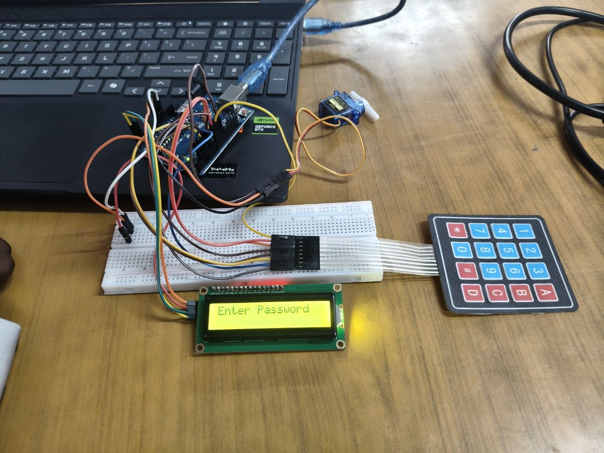

*PULSE TEAM*  
*ARDUINO-BASED AUTOMATIC RESTRICTED AREA ACCESS CONTROL SYSTEM*

*DESCRIPTION*

        An Automatic Restricted Area Access Control System is an electronic system designed to control entry into a restricted area. The IR sensor detects a person approaching the entrance, and the keypad is used to enter a password. The LCD display shows the access status. If the correct password is entered, the Arduino rotates the servo motor to open the barrier and the LED indicates authorized access. If an incorrect password is entered, the barrier remains closed and the LED indicates unauthorized access.

*MATERIALS USED*

➤ Arduino Uno  
➤ IR Sensor  
➤ Servo Motor (SG90)  
➤ 4×4 Num Pad / Keypad  
➤ 16×2 LCD Display  
➤ LED  
➤ 220Ω Resistor  
➤ Breadboard  
➤ Connecting Wires  
➤ USB Cable / Battery  
➤ Barrier/Gate setup

*PROCEDURE*

  1\. Circuit Preparation  
        ➤ Connect the IR sensor, keypad, LCD display, LED, and servo motor to the Arduino.  
  2\. Person Detection  
        ➤ Place the IR sensor near the restricted-area entrance.  
        ➤ When a person approaches, the IR sensor sends a signal to the Arduino.  
  3\. Password Verification  
        ➤ The LCD asks the person to enter the password using the keypad.  
        ➤ The Arduino checks whether the entered password is correct.  
  4\. Automatic Barrier Control  
        ➤ If the password is correct, the LED indicates authorized access and the servo motor    
            opens the barrier.  
        ➤ If the password is incorrect, the barrier remains closed and the LCD displays an   
            access-denied message.

*RESULT*

CONCLUSION

         The Arduino-based Automatic Restricted Area Access Control System was successfully designed and tested. It provides a simple and automatic method for controlling access to restricted or hazardous areas using password verification and a servo-operated barrier.

